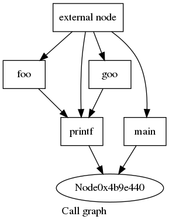
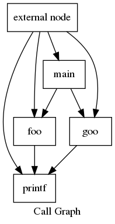

# OverCG
Generate call graph of c program from its corresponding LLVM IR

# Usage
	python OverCG.py -h
	usage: OverCG.py [-h] [-i INPUT] [-o OUTPUT] [-e] [-s]
	
	optional arguments:
	  -h, --help            show this help message and exit
	  -i INPUT, --input INPUT
	                        the input file
	  -o OUTPUT, --output OUTPUT
	                        the output file
	  -e, --externalNode    make call graph with external node
	  -s, --show            show the call graph using xdot
	  
# example
If we want to get the call graph of the following c program,

	#include<stdio.h>
	
	void foo(){printf("hello foo!");}
	void goo(){printf("hello goo!");}
	
	void main(){
	  int x = 1;
	  void (*r)() = &foo;
	  void (*s)() = &goo;
	  void (*p)();
	  if(x)
	    p = r;
	  else
	    p = s;
	  p(); // print the called function name
	}
	
we can use the opt tool in LLVM, like this,
>	opt --dot-callgraph test1.ll --disable-output
>	xdot callgraph.dot

The above command will output the following call graph,

it is not accurate, since the opt tool can noly process the directly call.
However, when using OverCG, we can get the following call graph,

Another example **bitcnts** is from [cbench](https://sourceforge.net/projects/cbenchmark/files/cBench/V1.1/)  that is a collection of open-source programs with multiple datasets assembled by the community. The source files can be find in the bitcnts directory. It uses an array to store the function pointers and  calls the actual function through the function pointer, the code snippet is as following.

	static int (* CDECL pBitCntFunc[FUNCS])(long) = {
	    bit_count,
	    bitcount,
	    ntbl_bitcnt,
	    ntbl_bitcount,
	    /*            btbl_bitcnt, DOESNT WORK*/
	    BW_btbl_bitcount,
	    AR_btbl_bitcount,
	    bit_shifter
	  };
	  ......
	  for (j = n = 0, seed = 1; j < iterations; j++, seed += 13)
		 n += pBitCntFunc[i](seed);
		 
The following graph is the call graph of **bitcnts** generated by opt tool.

From the graph, we can see that the there does not exist any edge from main function to function bit_count, bitcount, ...,  bit_shifter.
But it can be done by OverCG, see the following graph.
